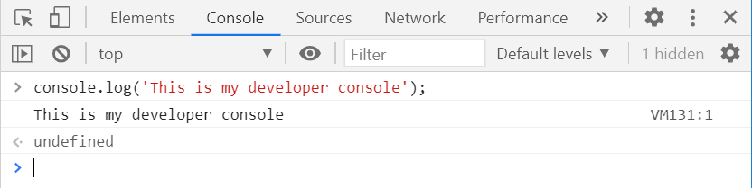

# Introduction to Node.js and ES6+ Javascript
In this lesson we will briefly introduce Node.js / ES6 syntax, variables, operators, and types.  *Warning* : Don't worry if you get overloaded with information - this is purely an introduction to expose you to language constructs and we will cover all of this in depth in dedicated sections later.
## What is "ES6+" and how is it different from "javascript"
ES6 or ECMAScript 2015 (and ES2016, ES2017, etc) are the latest specifications of the Javascript language that provides more powerful constructs than "traditional" Javascript and fix many of the flaws and annoyances of previous versions.  Changes are expected every year, but ES6 is the major overhaul that made everything better.

## Reserved Words / Syntax
To avoid cluttering this document, here is a link to the [list of ES6 reserved keywords](https://developer.mozilla.org/en-US/docs/Web/JavaScript/Reference/Lexical_grammar#keywords) as a reference.

### Coding Basics
These are the absolute basics for writing correct Javascript :
1.  Each line should be one logical unit of work where possible
2.  Each line should be terminated by a semicolon (except for braces)
3.  Variables should be declared with the correct qualifier (see [Variables](#variables))
4.  Variables should be named according to defined standards (see [Variables](#variables))
5.  `//` starts a single line comment

## Console
The `console` object is used to output strings.  `console.log()` is one of the simplest functions and helpful for printing status messages to display to users and printing log messages to track what your program has done or is doing.  It can be used for very simple debugging if you just want to see the value of something during development.  It doesn't come close to replacing a real debugger, but we'll cover that in a dedicated lesson.  It's introduced here because we will use it in examples below.
## Variables
Variables are named storage for data and are used to easily store/reference data in memory.  Note that unique variable names can be declared once and will generate an exception if re-declared.

There are three ways to declare a variable in ES6 but we will only use two. See the note on `var` about how you should **never use it**.  We only cover `var` because you are sure to come across it in other projects but **you should never, ever, include `var` in your code** and you should be aware of very strange situations that can arise from its (mis)use.
1.  `const` - This declares a constant... kind of (more on that later).  `const` variables can not be reassigned and the interpreter will throw an exception if you try.  You should use `const` to declare variables that should never be reassigned.  This has the bonus of throwing an exception if you do try to reassign it since you told the interpreter that you never would.  Use `const` whenever possible.
2.  `let` - This declares a variable that may be reassigned.  The only notable difference between `const` and `let` is that the interpreter will not error if a variable defined by `let` is reassigned.
3.  `var` - In older versions of Javascript this was the only way to declare a variable.  It behaves similarly to `let` but there are some odd behaviors associated with `var` which is why you should **never use it**.  We'll cover some of the oddities of `var` at a later date to show exactly why it's terrible.  Have I mentioned that you shouldn't use `var`?  Don't use `var`.

We will cover the intricacies of variable declarations in a future lesson.

### const Example
```javascript
const myString = 'hello';
console.log(myString); // Prints 'hello' to the console
myString = 'goodbye'; // This will throw an exception due to reassignment of a const
console.log(myString); // This code will never be reached due to the exception above
```
### let Example
```javascript
let myString = 'hello';
console.log(myString); // Prints 'hello' to the console
myString = 'goodbye'; // This reassignment is acceptable for 'let'
console.log(myString); // Prints 'goodbye' to the console
```

### var Example
```javascript
var myString = 'hello';
console.log(myString); // Prints 'hello' to the console
myString = 'goodbye'; // This reassignment is acceptable for 'var'
console.log(myString); // Prints 'goodbye' to the console
```
### Variable Re-declaration Exceptions
```javascript
const myString = 'hello';
console.log(myString); // Prints 'hello' to the console
const myString = 'goodbye'; // This will throw an exception due to re-declaration
console.log(myString); // This code will never be reached due to the exception above
```
### Variable Naming Conventions
There are two limitations to variable names
1.  The name must contain only letters, digits, or the symbols $ and _.
2.  The first character must not be a digit
   
While not a requirement enforced by the language, variables should always be named in camel case (*myVariableName*) with a name that accurately describes its purpose and/or contents.  That said, it is a common convention, though not enforced, to name constants that will never change in all upper case like `const ILL_NEVER_CHANGE`.  Variable names like `var1`, `var2`, `var3` are useless and should never be used.

Variables are **case sensitive** such that `myString` and `myStRiNg` are two different variables.
Variables should always be declared before use.  It was possible to initialize and use a variable without a declaration in the past but should not be done and we will take steps to prevent that from being possible.
## "Types"
While Node.js is dynamically typed, in that you do not need to explicitly define the type in code, the interpreter will infer the type and assign it to one of the language internal types.

### Primitive Types
1.  Number - This type will represent both integer and floating point numbers but has a max integer range of (253-1)<sup>2</sup> (9007199254740991) to -(253-1)<sup>2</sup> (-9007199254740991)
2.  String
3.  Boolean
4.  null
5.  undefined
6.  Symbol

### Complex Types
6.  Object - A collection of other properties
7.  Array - Technically an array is a special type of Object but it can be helpful to think of them as separate types.

### Less Common Types
1.  BigInt - used to represent integer values larger than possible with Number
2.  Symbol - For creating unique identifiers

Type specific operator :
1. `typeof` - This operator returns the type of a variable.  For example, given `const myString = 'hello'`, `typeof(myString)` would return `string`.  `typeof` can be applied with or without parentheses such that `typeof(myString)` and `typeof myString` are equivalent.

### Type Conversion
Type conversion occurs automatically as required.  For example, `console.log(myVar)` will automatically apply String conversion to convert `myVar` to a String type because `console.log()` expects a String.

Numeric conversion occurs in mathematical functions and expressions automatically.  For example `const result = '10' / '2'` will convert 10 and 2 to Number types, then apply the division operator.  `Number(myVar)` can be used to explicitly convert `myVar` to a Number.
Numeric conversion follows these rules :
1.  `undefined` converts to `NaN` (Not A Number)
2.  `null` converts to `0`
3.  `true` converts to `1` and `false` converts to `0`
4.  `'string'` - The string is read "as is", whitespaces from both sides are ignored. An empty string becomes `0`. An error gives `NaN`.

Boolean conversion can also be applied explicitly or implicitly according to the following rules :
1. Values that are intuitively "empty", like 0, an empty string, null, undefined, and NaN, become `false`.
2. Other values become `true`.

For example, during Boolean conversion `const myString = 'hello'` would evaluate as `true`, `const myString = '0'` would evaluate as false, and `const myString = ''` would evaluate as false.  Boolean conversion can be applied explicitly like `Boolean(myString)` or implicitly in Boolean operators like `if (myString)` (more on `if` and other implicit conversions in the future).


TODO : Contrast this to strongly/statically typed languages that don't let you do it.


## Operators
Operator quick reference
1. Unary - Operator that has a single operand.  
2. Binary - Operator that has two operands
3. Ternary - Less common, but an operator that works with three operands.

### Unary
Unary operators have a single operand.  The `typeof` operator described above is a good example.  As you can see, it takes only a single parameter (operand) : `typeof myString`.
### Binary
Binary operators have two operands.  Most Math operators fall in this category, the addition operator for example : `1 + 2`.  In this example, the operator is `+` and the operands are `1` and `2`.

### Ternary
Ternary operators are covered in the [Conditional lesson](../008-Conditionals/README.md).

## Rapid Prototyping for Learning/Testing Purposes
When learning and testing, it can be helpful to execute small snippets of code in an interactive fashion without the overhead of creating a new file, writing code in the file, saving, and executing it with the Node interpreter.
### Chrome Developer Tools (Javascript Console)
The Chrome browser includes a suite of incredibly power developer tools.  We'll cover all of these in detail in the future, but the Javascript Console can be helpful to us immediately.  It's also handy for testing quick code snippets if you're already working in Chrome because it can be done in the browser without the need to start another program.
There are two main ways to access the developer tools :
1.  Click the settings hamburger icon at the top right, hover over *More tools*, then select *Developer Tools*.
2.  Shortcut
    1.  Linux / Windows : `F12` or `ctrl+shift+I`
    2.  Mac OS : `cmd+shift+I`

Once the developer tools window opens, click the *Console* tab to access the Javascript Console.  **Note** : It is common to see log messages, errors, and warnings that have been emitted by a webpage here since this is the console associated with the current page/tab.  You can ignore those for now but they are helpful for researching problems with webpages.  The *Clear console* button will remove all previous messages and present you with a clean console, at least until the webpage emits another message.

In the image below, the *Console* tab is shown in <span style="color:#0016e7">blue</span>, *Clear console* in <span style="color:#b30000">red</span>, console output (showing an error) in <span style="color:#d4b400">yellow</span>, and the console input area in <span style="color:#02c40b">green</span>.


Side note : This same functionality is available in Firefox but we'll stick to Chrome for this course.

This console will allow you to enter any valid Javascript and have Chrome interpret it on the fly.

### Node.js REPL
The same can be accomplished using the Node.js REPL (Read-Eval-Print Loop).  To access the REPL :
1.  Open a terminal / command prompt
2.  Type `node` and hit enter (this assumes the node executable is in your path)
You will receive a welcome message and a prompt where you can enter Javascript to be executed by the interpreter.


## Lab - Writing your first Node.js script
1.  Create a new file named `lab003.js`
2.  Declare variables of the following types, value is unimportant so long as type is correct.
    1.  String
    2.  Number
    3.  Boolean
    4.  null
3.  Write the type of each variable to the console
4.  Write the value of each variable to the console in the same order as #3
5.  Execute your script with the command `node lab003.js`

Requirements :
1.  Follow [Coding Basics](#coding-basics) 
2.  Follow [variable declaration and naming standards](#variables)
3.  A total of 8 lines should be printed to the console
4.  Lines 1 through 4 should contain only the type of one defined variable per line
5.  Lines 5 through 8 should contain only the value of one defined variable per line
6.  Line 1 should be type of the variable whose value is output on line 5
7.  Line 2 should be type of the variable whose value is output on line 6
8.  Line 3 should be type of the variable whose value is output on line 7
9.  Line 4 should be type of the variable whose value is output on line 8

Assuming you declare four variables, one of each type required, your output will be similar to this though the order and values may be different.
```
string
number
boolean
object
This is my string
42
true
null
```