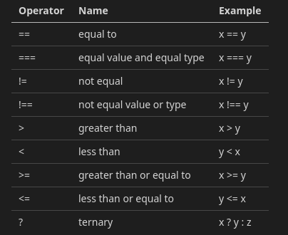

# Conditionals
Conditionals allow us to optionally execute logic dependent on other variables and expressions.  The simplest is *if/then* such as "if the temperature is greater than the thermostat setting, turn on the air conditioner".

These decisions are made with Comparison operators and Logical operators discussed previously.  A quick review :



Logical Operators : 

*&&* : logical and

*||* : logical or

*!*  : logical not

The thermostat example could be written :
```javascript
const tempSetting = 23;
const currentTemp = 20;

if (currentTemp > tempSetting) {
  // Turn on a/c
}
```

Multiple Comparison operators can be joined together with logical operators.

AND example :
```javascript
const systemEnabled = true;
const tempSetting = 23;
const currentTemp = 20;

if (systemEnabled && currentTemp > tempSetting) {
  // Turn on a/c
}
```

OR example :
```javascript
const manualOverride = true;
const tempSetting = 23;
const currentTemp = 20;

if (currentTemp > tempSetting || manualOverride) {
  // Turn on a/c
}
```

And, more complex evaluations are possible **so long as you respect order of operations** :

```javascript
const systemEnabled = true;
const manualOverride = true;
const tempSetting = 23;
const currentTemp = 20;

if (systemEnabled && (currentTemp > tempSetting || manualOverride)) {
  // Turn on a/c
}
```

*if/else* lets us choose between two different blocks of logic.  Changing example types to a traffic light :
```javascript
const lightColor = 'red';

if (lightColor === 'green') {
  // go
} else {
  // stop
}
```

*if/else if/else* expands this further.
```javascript
const lightColor = 'purple';

if (lightColor === 'green') {
  // go
} else if (lightColor === 'yellow') {
  // hope we make it
} else if (lightColor === 'red') {
  // stop
} else {
  // what type of traffic light is this?
}
```

The simplicity of the traffic light example above also lends itself to usage of a *switch* statement.  The expression in the *switch(expr)* is evaluated once and compared to each case.  If all explicit cases fail then the default case is executed (like the *else* above).  The exact same logic could be written as :

```javascript
const lightColor = 'purple';

switch(lightColor) {
  case 'green':
    // go
    break;
  case 'yellow':
    // hope we make it
    break;
  case 'red':
    //stop
    break;
  default:
    // what type of traffic light is this?
}
```

Ternary operators are helpful for doing a *if/else* in a compact, one line form.  The first operand is the conditional.  If it evaluates as true then the returned value is the second operand.  If it evaluates as false then the third operand is returned.

If you remember the modulo operator %, we can use it to easily determine if a number is even or odd on one line with the ternary operator.

```javascript
const number = 7;
const isEven = number % 2 === 0 ? 'it is even' : 'it is not even';
```
In the example above, if the remainder of *number % 2* is equal to zero then *'it is even* is returned.  If the result is not zero then *it is not even* is returned.

A more realistic application of the logic above would be to return a boolean to isEven, but that can be simplified even further with no need for the ternary operator :
```javascript
const number = 7;
const isEven = number % 2 === 0;
```
Since the *===* comparison operator is used, *number % 2 === 0* will be evaluated and *true* or *false* assigned to *isEven*.