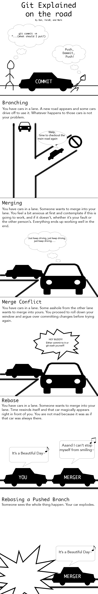
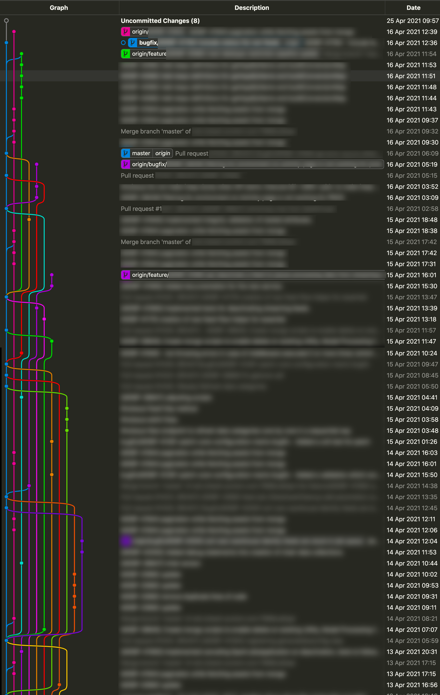

# Git (Source Control Management)
Git is an implementation of SCM that allows for decentralized source versioning and collaboration.  There are many others like CVS, Subversion (SVN), ClearCase, etc.  Git has become widely used due to its powerful and easy to use features.  It basically tracks all changes that are made to your code and allows you to manage multiple different changes separately at the same time.  One great advantage is that all code and changes can be stored in each physical repository rather than a central location.  Because of that, your master repo could be lost and your work is unaffected because you have a local copy.  Additionally, you could actually restore the master repo from your copy with a few easy commands.

While we're only covering the most important bits of Git here, there's [an entire book](https://git-scm.com/book/en/v2) by Scott Chacon and Ben Straub that is available for free online.



## Initialize a new repository
To create a brand new repo, create a folder to hold it then execute the `git init` command.  It will print a response of `Initialized empty Git repository in ...`.  That's it!  Now you're ready to start working with it.

## Copy (clone) an existing repository 
Cloning an existing remote repo takes one simple command : `git clone <url>`.  For example, to clone the public repo for this class you would execute `git clone https://github.com/carpaltunnel/ArCA-Nodejs-2021-Public.git`.  You would then have a local folder named "ArCA-Nodejs-2021-Public" that would contain all the material as well as every change ever made.

## Making Changes (commits)
A "commit" is a change that you've made locally that you would like to be committed to the git repo so it becomes part of the change log and available to other repo users.  Changes are not committed automatically, you have to explicitly add and commit them.  As you make changes to your local repo they will be noted as "Unstaged Changes".  You can see these with the `git status` command.  To commit a local change you first need to stage the change with the `git add <file>` command.  Then, you can commit it with `git commit -m 'description of change goes here'`.  Below is a quick example that assume you're working in an existing git repo :

```bash
echo '123' > test.txt
git status
git add test.txt
git commit -m 'Committing test.txt for testing purposes'
git status
```

Every commit has a unique hash.  These hashes can be used to reference a certain commit or point in time for the repository.  Additionally, they can be used to jump to that point in time, or undo a specific commit.

## Commit Best Practices
Your commit messages (`git commit -m '<commit message>'`) should always be descriptive of the change being made.  In a professional environment, you've probably been assigned a task that will have a tracking number like a Jira / Github issue or some type of work ticket number.  You should always include this information in the commit message, usually at the beginning.  In addition to allowing others to easily find the reason for the change in the future, many ticketing system (like Jira and Github) integrate with your commit messages and will automatically link the commits to the issue referenced in them.  This is extremely helpful for software releases because it can automatically compile the list of changes and issues that prompted them.

## Differences
`git diff <filename>` will show you the difference between your local working copy and the committed code.  It's a good idea to always check the diff before you commit to be sure you're committing what you should be (and nothing more).
## Managing Multiple Changes (branches)
You'll often find yourself working on multiple changes or features concurrently.  Even if you aren't, it's highly likely that other members on your team will be working on the same code base as you, but making different changes.  Luckily, Git provides an easy way to manage this.  `branches` are pretty much what they sound like - branches in the code change hierarchy.  You'll always have a "main" or "master" branch that should be the clean, well tested, and deployed (or ready for release) code.  To make a change or add a new feature, you'll create a branch from the known good code, make your changes on the branch, then merge your branch back to the main branch after sufficient testing and approval.

Creating a branch is like getting your own special copy of the code that you can work on without affecting anyone else.  It can even exist in your local repository only so no one else could possibly have access to it until you "push" it.

Assuming your Git repo has at least one commit, you can execute `git branch <branch-name>` to create a new branch from the code as it exists on your current branch.

You can list all branches available to you with `git branch`.  

To switch to a different branch you use `git checkout <branch-name>`.  

These three commands (combined with add/commit) allow you to keep your changes separate.  For example :
```bash
# Assume we're on the "master" branch
# Create new branch named "issue7-fix-error"
git branch issue7-fix-error
# Switch to "issue7-fix-error" branch
git checkout issue7-fix-error
# Make changes to files to fix the error... then
git add changed-file1 changed-file2 changed-file3
git commit -m 'issue7 - fixing error by fixing it'
# Switch back to "master" branch
git checkout master
# None of your changes are here, because they're all on the issue7-fix-error branch
```

Now that you know how to branch and commit, let's see about getting those changes made available elsewhere.
## Push it... 

Usually you'll have a central Git repository server that runs on enterprise level hardware with redundancy and backups.  Since you have a full copy of the code locally, data loss isn't a big worry, but have a central "origin" server allows everyone on your team to have a standard reference point.  You don't *have* to have one, but it makes your life a lot easier and it's rare that you wouldn't.  For this class, Github is our "origin".

If you've cloned an existing repo, created a branch, made a change, and committed it - all you need to do now is execute `git push origin`.  This will "push" your branch and changes to the origin repo.  We haven't merged anything yet, so all your changes exist only on your branch, but now that branch is available on the origin server and others could check it out and look at or work on it if needed.

## Merging Code + Pull Requests
Locally, to merge code between branches you simply checkout the target branch (where we'll merge code INTO), say "master", then execute `git merge source-branch-name` where "source-branch-name" is where we're merging code FROM.  If there are no conflicts that can't be automatically resolved, changes from "source-branch-name" will be copied/merged into "master" and a note will be added to the commit log.
```bash
# Assuming we have "bugfix-branch" and "master", we want to merge "bugfix-branch" to master locally
git checkout master
git merge bugfix-branch
# Easy enough?
```


This is nice for managing multiple branches locally, but not terribly realistic when working with a team.  More realistically, you'll need to create a "Pull Request" on the origin server.  A pull request, or "PR", is just a request to the repo maintainer to merge your branch into another branch.  A diff between your source branch and the target branch will be created and the maintainer can choose to approve/merge the PR, reject it, or add notes and to-do's that you need to complete before it will be approved.

When you push changes from a local branch to your origin server, it will usually return a URL that you can use to create a PR.
```bash
# Assuming we have "bugfix-branch" and "master", we want to merge "bugfix-branch" to master remotely
git checkout bugfix-branch
# Make changes and commit them - excluded here
git push origin
# This will probably return a URL you can use to create the pull request.
```

[Git Graph](https://marketplace.visualstudio.com/items?itemName=mhutchie.git-graph) is a nice plugin for VS Code that will allow you to visualize the branches, commits, and merges in your repo.


## Managing Conflicts
But, nothing is ever simple is it?  You may find yourself working in the exact same area of code as another person simultaneously.  When this happens, Git may not be able to automatically figure out how to merge the code cleanly.  If it can't, a "merge conflict" will be thrown and you will need to "resolve" the conflict manually.  There are many tools available to do this.  OpenDiff is a common one, but it's also possible in VSCode as well as other IDEs and Git GUIs.

## Stash
Everyone needs a stash.  The "stash" command allows you to store your changes locally without actually committing them.  Simply executing the command `git stash` will stash the changes on your working copy.  `git stash pop` will restore the latest stashed code.  While those two commands will get you through most scenarios, you can get a bit more fancy by giving your stashes descriptions like `git stash push -m 'my stash'`.  Then, you can list your stashes with `git stash list` and restore (apply) them with `git stash apply --index`.  This mostly comes in handy when you need to try something locally and may or may not use it later.


## Tags
Tags are basically a named pointer, or label, to a certain point in time.  They often get used for releases or important points in time that may need to be referenced or recovered later.  Generally, you'll probably want to use annotated tags and you can create them with `git tag -a myTagName`.  The annotated tags include information about who created the tag and when, where non-annotated (lightweight) tags are simply a name for an object/commit.

## Reverting an Uncommitted Change
git checkout

## Reverting a Commit
git revert

## Logs
GitLens and other IDE features make inspecting the Git log easy but you can always use the `git log` command to dive in and inspect the commits.
## NVIE Branching Model

Intro to version control / Git
        How it works / what it's for / why it's awesome
        How it differs from previous SCM implementations

        how to init a new local repo, how to add remote origin
        how to init an existing / remote repo
        Command line quick reference
            clone
            log
            status
            diff
            commit (with comments)
            revert
            branch
            checkout
            merge
            tag (vs branch)
            pull requests
            stash
        Semi-advanced topics    
            what is HEAD and detached head
            create branch from detached HEAD or tag
        Compare command line to VSCode and GitKraken
        NVIE branching model
        Proper commit logs for professional development (Jira, Github issues, etc)
        Demo GitGraph or branch tracking in GitKraken
        .gitignore
